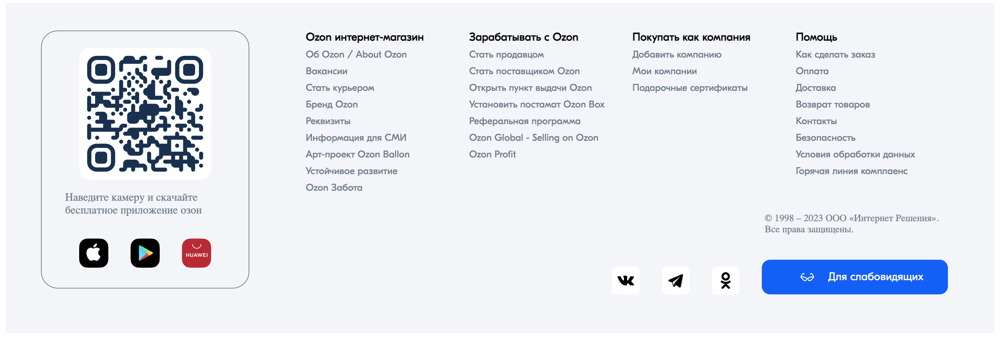
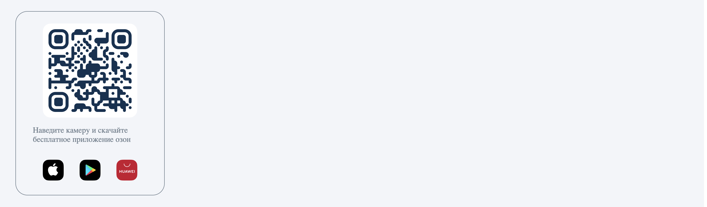
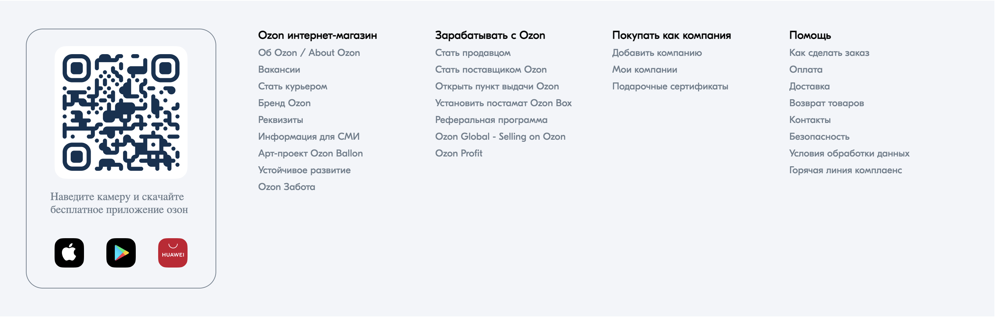

## Flexbox. Footer, ozon

_В данном задании мы поработаем с flexbox и сделаем футер для сайта `https://www.ozon.ru/`._  

### Релиз 0.

В `release 0` мы сделаем контейнер с qr-кодом. 

`div` для него уже готов `class="qr-container"`.

_Пример выполнения релиза 0_

У тебя уже есть два файла `index.html` и `style.css`.

Ты можешь найти изображения внутри папки images, поэтому путь будет учитывать папку и выглядеть подобным образом: `src="./images/qr-code.png"` .

Сделай цвет футера серым: `background-color: #f2f5f9` (Да, он весь светло-серого цвета).

#### *Подсказки*: 
- Не забывай называть классы так, чтобы имя не путало и можно было понять, о чем идет речь. 
- Будет эстететично, если задать padding для `qr-container`.
- Подумай какие должны быть дочерние элементы у `qr-container`. Стоит ли что-то объединить в общий div.
- Не забывай подумать про margin и padding для каждого элемента. 
- Цвет для границы `qr-container`: #707F8D.
- Размер шрифта мождно сделать 16px.

_В конце релиза сделай commit._

### Релиз 1.

Теперь мы сделаем еще одну часть футера.

Во-первых, создай div-контейнер и назови его `class="footer-menue"`. После чего подумай, какие еще потребуются контейнеры и какие свойства flexbox использовать.  
Заголовки можешь сделать c тегом `span`, а остальные элементы меню с тегом `a`.

Чтобы не было путаницы, ты можешь начать с того, что сделаешь один столбец. 

После того как ты сделал столбцы, убедись, что у тебя достаточный отступ от `qr-container`. И подключи шрифт `font-family: "GTEestiProDisplay";`.

Сделай размер шрифта у названий столбцов - 16px, а у элементов - 14px.

Сдалай ховер эффект для ссылок - цвет `#005bff`, чтобы при наведении они были синего цвета, как у оригинального сайта.

_В конце релиза сделай commit._

### Релиз 2.

Теперь мы сделаем еще одну часть футера.

В этом релизе мы постараемся добиться еще большего визуального сходства с оригиналом и добавим последнюю часть футера с ссылками на соцсети, назовем ее `class="footer-links"`. 

Как и в предыдущих релизах залог успеха заключается в том, как мы поделим контент на div-ы. 

Дополнительно можешь подумать о том, как сделать эффекты при наведении мыши. 

_В конце релиза сделай commit, push и pull request._  

_Размести проект на pages github._
